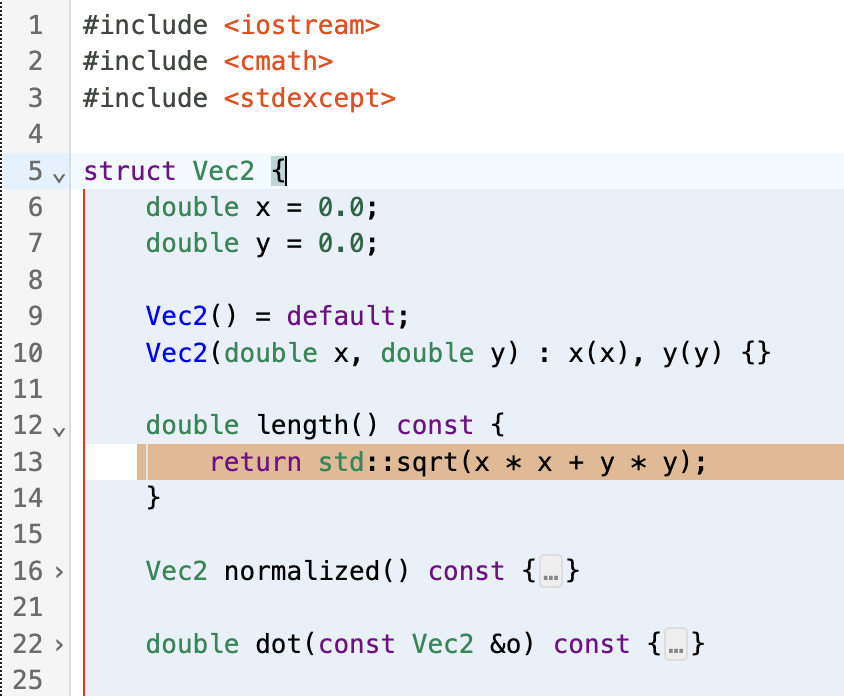

# CodeMirror Foldable Indentation Guides

A CodeMirror extension that renders indentation guides that can be folded on click.
Utilizes [@replit/codemirror-indentation-markers](https://github.com/replit/codemirror-indentation-markers) for indentation logic.



### Usage

```ts
import { basicSetup } from 'codemirror';
import { EditorState } from '@codemirror/state';
import { EditorView } from '@codemirror/view';
import { indentationMarkers } from '@replit/codemirror-indentation-markers';

const doc = `
def max(a, b):
  if a > b:
    return a
  else:
    return b
`;

new EditorView({
  state: EditorState.create({
    doc,
    extensions: [basicSetup, indentationMarkers()],
  }),
  parent: document.querySelector('#editor'),
});
```

### Options

You can provide an options object to `indentationMarkers()` with the following
optional properties:

- `highlightActiveMarker`

  Boolean that determines whether the active block marker is styled
  differently. Setting this to `false` provides a significant performance
  enhancement because it means that markers do not need to be regenerated
  when the selection changes. Defaults to `true`.

- `highlightHoveredMarker`

  Boolean that determines whether the hovered block marker is styled
  differently. Defaults to `true`.

- `highlightActiveBlockBackground`

  Boolean that determines whether to change background color of line from active block.
  Defaults to `true`.

- `highlightHoveredBlockBackground`

  Boolean that determines whether to change background color of line from hovered block marker.
  Defaults to `true`.

- `foldBlockOnClick`

  Boolean that Determines whether block markers are foldable.
  Defaults to `true`.

- `hideFirstIndent`

  Boolean that determines whether markers in the first column are omitted.
  Defaults to `false`.

- `markerType`

  String that determines how far the indentation markers extend. `"fullScope"` indicates that the markers extend down the full height of a scope. With the `"codeOnly"` option, indentation markers terminate at the last nonempty line in a scope. Defaults to `"fullScope"`.

- `thickness`

  Integer that determines the thickness in pixels of the indentation markers. Defaults to `1`.

- `activeThickness`

  Integer that determines the thickness in pixels of the active indentation markers. If `undefined` or `null` then `thickness` will be used. Defaults to `undefined`.

- `hoverThickness`

  Integer that determines the thickness in pixels of the hovered indentation markers. If `undefined` or `null` then `thickness` will be used. Defaults to `undefined`.

- `additionalPadding`

  Integer that determines the additional padding for each left and right side of marker button for more clickable and hoverable area (in pixels). Defaults to `0`.

- `colors`

  Object that determines the colors of the indentation markers.

  - `light`

    String that determines the color of the markers when the editor has a light theme. Defaults to `#F0F1F2`.

  - `dark`

    String that determines the color of the markers when the editor has a dark theme. Defaults to `#2B3245`.

  - `activeLight`

    String that determines the color of the active block marker when the editor has a light theme. Only applies if `highlightActiveMarker` is `true`. Defaults to `#E4E5E6`.

  - `activeDark`

    String that determines the color of the active block marker when the editor has a dark theme. Only applies if `highlightActiveMarker` is `true`. Defaults to `#3C445C`.

  - `hoverLight`

    String that determines the color of hovered indent markers when using a dark theme. Only applies if `highlightHoveredMarker` is `true`. Defaults to `#E4E5E6`.

  - `hoverDark`

    String that determines the color of hovered indent markers when using a dark theme. Only applies if `highlightHoveredMarker` is `true`. Defaults to `#3C445C`.

  - `backgroundLight`

    String that determines the color of active background when using a light theme. Only applies if `highlightActiveBlockBackground` is `true`. Defaults to `#e4e5e630`.

  - `backgroundDark`

    String that determines the color of active background when using a dark theme. Only applies if `highlightActiveBlockBackground` is `true`. Defaults to `#3c445c30`.

  - `backgroundHoverLight`

    String that determines the color of hovered background when using a light theme. Only applies if `highlightHoveredBlockBackground` is `true`. Defaults to `#e4e5e630`.

  - `backgroundHoverDark`

    String that determines the color of hovered background when using a dark theme. Only applies if `highlightHoveredBlockBackground` is `true`. Defaults to `#3c445c30`.

#### Example

```ts
new EditorView({
  state: EditorState.create({
    doc,
    extensions: [
      basicSetup,
      indentationMarkers({
        highlightActiveBlock: false,
        hideFirstIndent: true,
        markerType: 'codeOnly',
        thickness: 2,
        colors: {
          light: 'LightBlue',
          dark: 'DarkBlue',
          activeLight: 'LightGreen',
          activeDark: 'DarkGreen',
        },
      }),
    ],
  }),
  parent: document.querySelector('#editor'),
});
```
